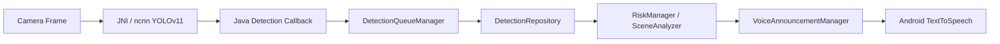
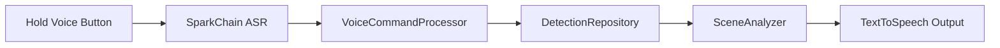

<div align="center">

# BlindRealTimeAlert

Android real-time visual awareness and voice alert assistant for accessible mobility.

[](LICENSE)
[](https://developer.android.com/)
[](app/src/main/java/com/tencent/yolov11ncnn)
[](https://github.com/Tencent/ncnn)

</div>

BlindRealTimeAlert 是一个运行在 Android 端的实时环境感知与语音提示应用，面向视障出行辅助场景。项目使用 YOLOv11n 与 ncnn 在手机端完成目标检测，通过目标过滤、短时跟踪、风险判断和中文语音播报，把摄像头画面中的行人、车辆、障碍物等信息转换为简洁提示。

项目提供完整 Android 工程，可直接编译、安装和二次开发。视觉检测、风险播报、摄像头切换和 CPU/GPU 切换可独立运行；语音识别使用讯飞 SparkChain SDK，账号凭据不随仓库提交。

## Features

| 能力 | 说明 |
| --- | --- |
| 实时检测 | 使用 YOLOv11n ncnn 模型在 Android 设备端执行目标检测。 |
| 风险播报 | 根据目标类型、画面方位、距离趋势和稳定性生成中文提示。 |
| 主动查询 | 按住语音按钮后说出查询指令，获取前方环境描述。 |
| CPU/GPU 切换 | 主界面提供计算模式切换入口，支持运行时切换 ncnn 推理后端。 |
| 相机切换 | 支持前后摄像头切换，检测结果叠加在实时预览画面上。 |
| 运动状态判断 | 结合传感器数据区分行走、静止和手机转动，降低误播概率。 |

## Tech Stack

| 层级 | 技术 |
| --- | --- |
| App | Android Java, Android TextToSpeech |
| Vision | YOLOv11n ncnn model, ncnn, OpenCV Mobile |
| Native | C++, JNI, CMake, Android NDK |
| Voice | 讯飞 SparkChain Android SDK |
| Build | Gradle, Android Gradle Plugin |

## Upstream

BlindRealTimeAlert is based on [`nihui/ncnn-android-yolo11`](https://github.com/nihui/ncnn-android-yolo11), an Android YOLO11 realtime demo built with ncnn and OpenCV Mobile.

Key upstream dependencies:

| Project | Role |
| --- | --- |
| [`nihui/ncnn-android-yolo11`](https://github.com/nihui/ncnn-android-yolo11) | Android YOLO11 ncnn sample project. |
| [`Tencent/ncnn`](https://github.com/Tencent/ncnn) | Neural network inference framework used by the native detection pipeline. |
| [`nihui/opencv-mobile`](https://github.com/nihui/opencv-mobile) | Android OpenCV Mobile package used by the native camera and image pipeline. |

## Quick Start

推荐环境：

| 工具 | 版本 |
| --- | --- |
| Android Studio | 稳定版 |
| JDK | 17 |
| Android SDK | 33 |
| Android Gradle Plugin | 7.3.0 |
| NDK | 26.1.10909125 |
| CMake | 3.10.2 |
| Android 设备 | Android 7.0 及以上 |

克隆仓库：

```bash
git clone https://github.com/chow651/BlindRealTimeAlert.git
cd BlindRealTimeAlert
```

使用 Android Studio 打开仓库根目录，等待 Gradle Sync 完成。同步失败时优先检查 JDK、Android SDK、NDK 和 CMake 版本。

编译 Debug APK：

```powershell
.\gradlew.bat :app:assembleDebug
```

macOS 或 Linux：

```bash
./gradlew :app:assembleDebug
```

安装到 Android 设备：

```bash
adb devices -l
adb install -r app/build/outputs/apk/debug/yolov11ncnn-debug.apk
```

如果电脑连接了多台设备：

```bash
adb -s <device-serial> install -r app/build/outputs/apk/debug/yolov11ncnn-debug.apk
```

首次启动时授予相机、麦克风和通知相关权限。不同 Android 版本的权限弹窗顺序会有差异。

## Required Assets

仓库需要包含以下模型文件：

```text
app/src/main/assets/yolov11n_ncnn_model/yolov11n.ncnn.bin
app/src/main/assets/yolov11n_ncnn_model/yolov11n.ncnn.param
```

仓库需要包含以下 AAR 文件：

```text
app/libs/SparkChain.aar
app/libs/Codec.aar
```

替换模型时，需要保持 `app/src/main/jni/yolov11.cpp` 中的输入尺寸、输出解析和类别定义与新模型一致。

## Voice Setup

仓库不包含讯飞开放平台账号信息。默认状态下，项目可以完成编译、安装和视觉检测测试；按住说话和语音指令会在缺少凭据时提示不可用。

需要启用讯飞语音识别时，请按讯飞 SparkChain Android SDK 文档在本机 debug 资源中添加凭据。相关本地资源路径已被 `.gitignore` 忽略，请勿提交任何个人账号信息。

## Usage

启动应用后，主界面会显示实时相机预览和检测结果。顶部状态区域显示系统运行状态，并提供 CPU/GPU 计算模式切换和摄像头切换入口。底部语音区域支持按住说话，松开后执行识别到的指令。

常用语音指令：

| 指令 | 行为 |
| --- | --- |
| `前面有什么` / `查询` | 播报前方环境描述。 |
| `切换摄像头` | 切换前后摄像头。 |
| `切换 CPU` | 切换到 CPU 推理模式。 |
| `切换 GPU` | 切换到 GPU 推理模式。 |
| `暂停播报` | 暂停风险播报。 |
| `恢复播报` | 恢复风险播报。 |
| `帮助` | 播放帮助提示。 |

语音识别依赖本机讯飞凭据。未配置时，可以通过界面按钮完成主要检测、切换和播报测试。

## Architecture



主动查询链路：



更多模块说明见 [`docs/architecture/README.md`](docs/architecture/README.md)。

## Project Structure

```text
BlindRealTimeAlert/
  app/
    build.gradle
    libs/
      Codec.aar
      SparkChain.aar
    src/main/
      AndroidManifest.xml
      assets/yolov11n_ncnn_model/
      java/com/tencent/yolov11ncnn/
      jni/
      res/
    src/test/java/com/tencent/yolov11ncnn/
  docs/
    architecture/
  gradle/
  build.gradle
  settings.gradle
```

关键源码：

| 路径 | 职责 |
| --- | --- |
| `app/src/main/java/com/tencent/yolov11ncnn/MainActivity.java` | 主界面、相机入口和按钮交互。 |
| `app/src/main/java/com/tencent/yolov11ncnn/viewmodel/MainViewModel.java` | 界面状态转接和主流程调用。 |
| `app/src/main/java/com/tencent/yolov11ncnn/repository/DetectionRepository.java` | 检测、播报、语音识别和状态控制主流程。 |
| `app/src/main/java/com/tencent/yolov11ncnn/DetectionQueueManager.java` | 检测目标过滤、跟踪和稳定确认。 |
| `app/src/main/java/com/tencent/yolov11ncnn/VoiceCommandProcessor.java` | 语音指令解析。 |
| `app/src/main/java/com/tencent/yolov11ncnn/XFYunOfflineSpeechManager.java` | 讯飞 SparkChain 初始化和识别封装。 |
| `app/src/main/jni/yolov11.cpp` | ncnn 模型加载、推理和 NMS。 |
| `app/src/main/jni/yolov11ncnn.cpp` | JNI 接口和 Java 回调。 |
| `app/src/main/jni/ndkcamera.cpp` | Android 相机采集和预览绘制。 |

## Test

运行单元测试：

```powershell
.\gradlew.bat :app:testDebugUnitTest
```

测试覆盖：

| 范围 | 内容 |
| --- | --- |
| 风险判断 | 风险等级和场景分析。 |
| 检测队列 | 稳定确认和目标过滤。 |
| 语音指令 | 查询、切换、暂停和恢复指令解析。 |
| 主界面 | 关键控件和 CPU/GPU 状态同步。 |
| 配置边界 | 讯飞账号凭据不进入 main 资源。 |

## Debugging

常用 ADB 命令：

```bash
adb devices -l
adb logcat -c
adb logcat -v time
```

推荐关注以下日志标签：

| 标签 | 内容 |
| --- | --- |
| `ncnn` | 模型加载、相机状态和 native 推理。 |
| `DetectionRepository` | 检测、播报、语音识别和状态控制。 |
| `VoiceAnnouncement` | 播报队列和 TTS 执行。 |
| `DetDiag` | 检测链路诊断。 |
| `MotionDiag` | 运动状态诊断。 |

Windows 日志过滤示例：

```powershell
adb logcat -v time | findstr "ncnn DetectionRepository VoiceAnnouncement DetDiag MotionDiag"
```

## Troubleshooting

| 问题 | 处理方式 |
| --- | --- |
| Gradle Sync 失败 | 检查 Android Studio 是否使用 JDK 17，并确认 Android SDK、NDK 和 CMake 已安装。 |
| NDK 或 CMake 版本不匹配 | 在 Android Studio SDK Manager 中安装 NDK 26.1.10909125 和 CMake 3.10.2。 |
| APK 启动后没有语音识别 | 检查本机 debug 资源是否已按讯飞 SparkChain Android SDK 要求提供凭据。 |
| 模型加载失败 | 检查模型文件是否位于 `app/src/main/assets/yolov11n_ncnn_model/`，并确认文件名与代码一致。 |
| GPU 模式不可用 | 部分设备不支持 Vulkan 或相关驱动存在限制，可以切换到 CPU 模式继续测试。 |
| 安装时报 `more than one device` | 使用 `adb devices -l` 查看设备序列号，再执行 `adb -s <device-serial> install -r app/build/outputs/apk/debug/yolov11ncnn-debug.apk`。 |

## License

Copyright 2026 chow651.

BlindRealTimeAlert is licensed under the [Apache License 2.0](LICENSE).

第三方 SDK、模型和 native 依赖可能具有各自的授权条款。分发修改版本前，请确认相关依赖的许可要求。
